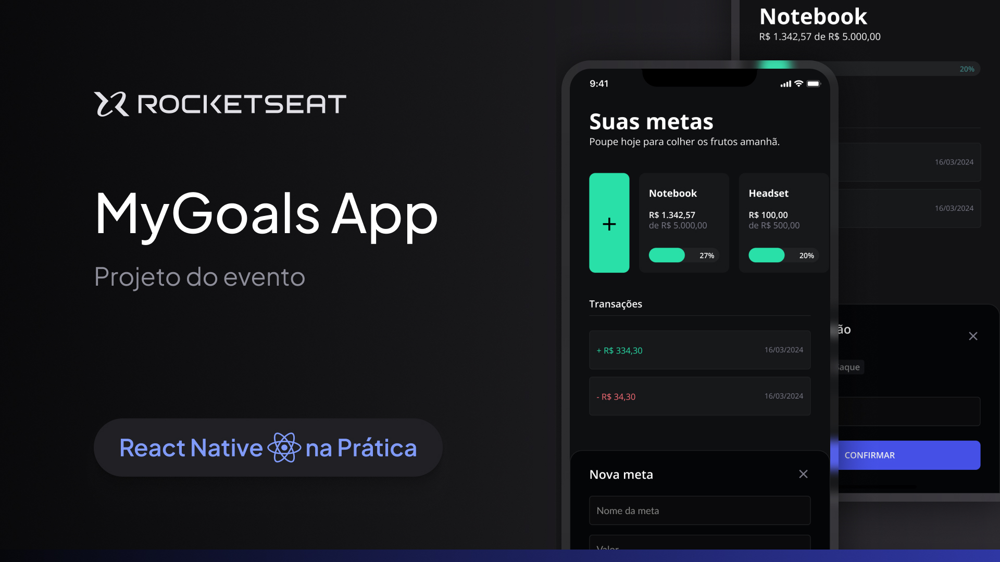

<h1 align="center"> Metas </h1>

 Um app pessoal de metas financeiras 

 
    <a href="#-sobre-o-projeto">Projeto</a>&nbsp;&nbsp;&nbsp;│&nbsp;&nbsp;&nbsp;
    <a href="#-tecnologias">Tecnologias</a>&nbsp;&nbsp;&nbsp;│&nbsp;&nbsp;&nbsp;
    <a href="#-features">Features</a>&nbsp;&nbsp;&nbsp;│&nbsp;&nbsp;&nbsp;
    <a href="#-licença">Licença</a>&nbsp;&nbsp;&nbsp;│&nbsp;&nbsp;&nbsp;
    <a href="#-dicas-para-usar-o-projeto">Dicas de uso</a>

 
    

 

 
    

### 💻 Sobre o projeto

Imagine que Rodrigo deseja comprar um Notebook novo que custa R$ 5.000,00. Ele acha prudente poupar o dinheiro necessário para comprar à vista, conseguir um bom preço e não comprometer o orçamento com parcelas.

Por isso, pode usar esse App Minhas Metas para poupar até atingir sua meta financeira para adquirir um Notebook novo. Esse é um dos projetos desenvolvidos em aula do evento React Native na Prática.

### 🚀 Tecnologias

Esse projeto foi desenvolvido com as seguintes tecnologias:

- React Native e Expo
- Typescript
- Tailwind
- Git e Github
- Figma

### 🚧 Features

- [x] Tela inicial para visualização de metas e transações gerais
- [x] Adicionar metas
- [x] Tela para transações
- [x] Lógica para as transações
- [x] Todas as transações na tela inicial
- [x] Popup de erro e sucesso
- [x] Botão para remover a meta
- [ ] Botão para editar nome da meta e valor

### 📜 Licença

Esse projeto está sob a licença MIT.

### 💡 Dicas para usar o projeto

`npm init` para baixar o node_modules

`npx expo start` │ `npm start` para rodar o expo e conseguir visualizar o projeto no emulador

`eas build --profile preview --platform all/android/ios` para gerar build na nuvem e outras pessoas conseguirem baixar seu app

tutorial eas: 
- https://youtu.be/id0Im72UN6w

tutorial build com expo:
- https://youtu.be/wYMvzbfBdY

---

Projeto feito através de uma aula da rocketseat. Alterado e adicionado algumas funcionalidades por KetCode.